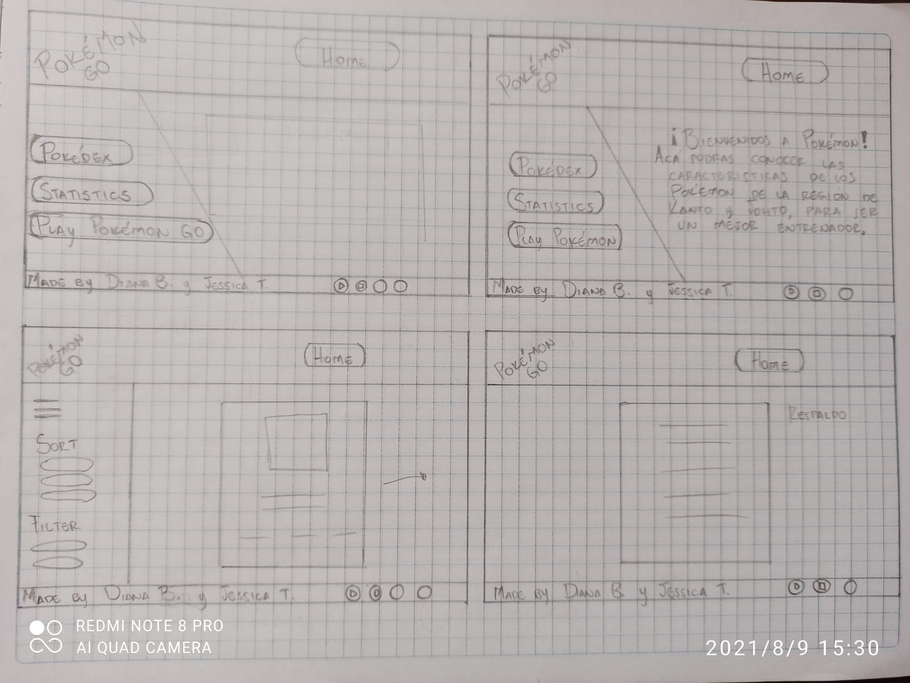
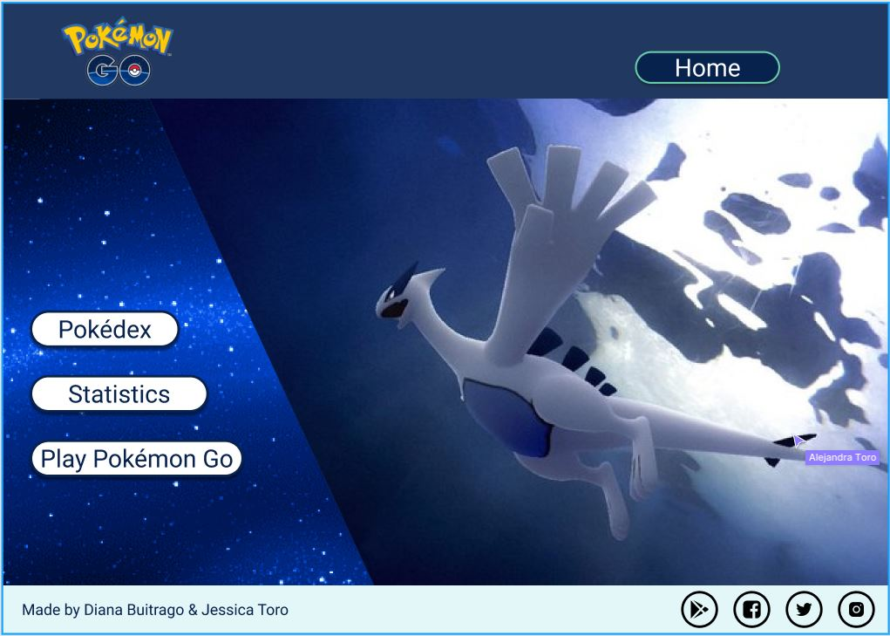
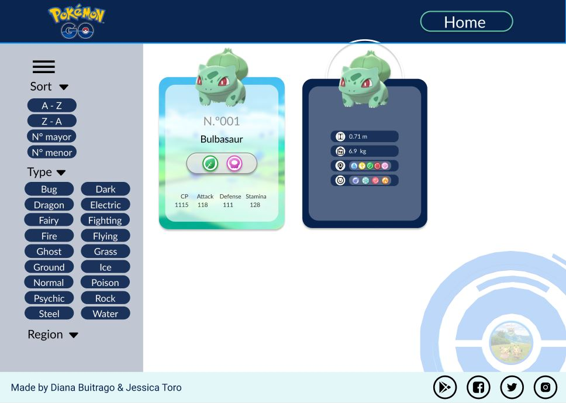
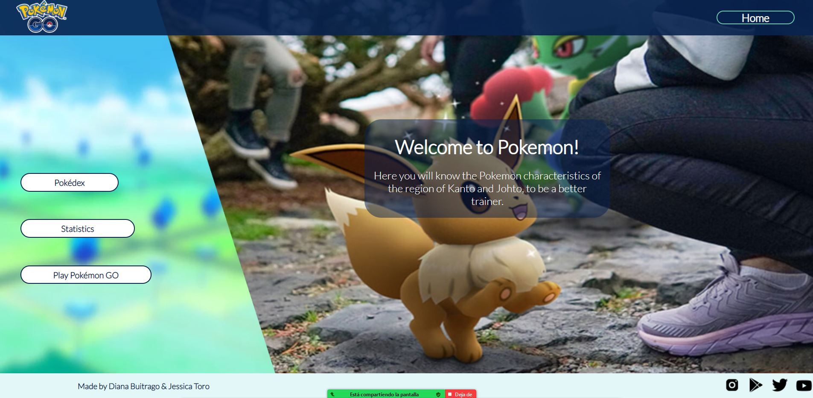
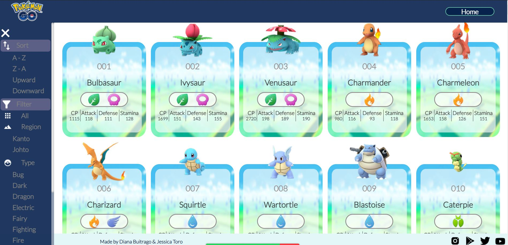
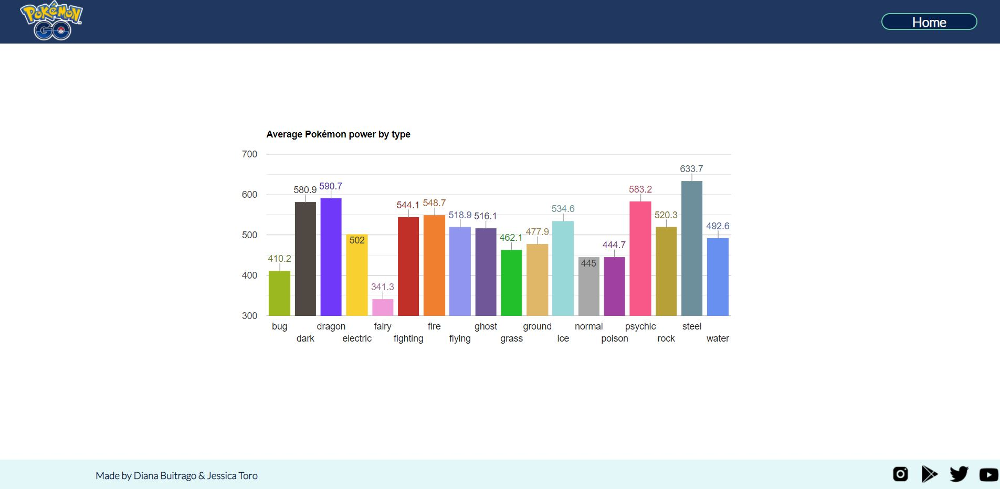

## Link a nuestro proyecto Pokemon GO DataLovers
![Link-Proyecto] (https://dimarbu.github.io/BOG003-data-lovers/src/index.html)  

## Definición del producto

### Nuestros usuarios

Nuestros usuarios son una comunidad de jugadores principiantes de Pokemon Go que quieran conocer acerca de las caracteristicas de cada pokemon de la región de Kanto y Johto.

#### Proceso de diseño

Para iniciar el proceso de diseño de nuestro proyecto se tomaron en cuenta varias fuentes como las encuestas a usuarios, feedback de nuestras compañeras, feedback de los coaches y de nuestra investigación del tema. Luego se realizó un prototipo de baja fidelidad donde queriamos plasmar el diseño inicial, como se ve a continuación.

De acuerdo al prototipo de baja fidelidad se elabora el protipo de alta fidelidad, del cúal se pide feedback para iterar, donde los coaches nos sugieren realizar un diseño similar a la marca de Pokémon GO.

* Prototipo de Alta Fidelidad Inicial

Teniendo en cuenta nuestro prototipo final realizamos los testeos de usabilidad con diferentes usuarios, donde se realizan las mejoras sugeridas con respecto al primer prototipo.

* Prototipo de Alta Fidelidad Final de acuerdo al Feedback recibido

#### Pantalla 1

#### Pantalla 2

Seguido del diseño de interfaz se trabaja en la implementación, dando como resultado final el siguiente:

#### Pantalla 1

#### Pantalla 2

##### Organización
Se podran visualizar todos los personajes de pokemon y se van a organizar por número (num) de manera ascendente y descendente. Tambien se podran organizar alfabeticamente por nombre (name) de A-Z y Z-A.

##### Filtros
Podremos filtrar por:
* Región (Kanto y Johto)
* Tipo al que corresponde el Pokemon  (bug, water, fire, poison, ...)

Los filtros son acumulativos, es decir se puede ordenar sobre los filtros que se realizan.

##### Cálculo
Se realiza un cálculo base con el cúal se genera una estadística que nos indica el promedio del poder por cada tipo de Pokémon. Está se realizó sumando todos los valores de los Stats (base-attack, base-defense, base-stamina, max-cp, max-hp) y dividiendo el resultado por el total de los datos (5).

La siguiente gráfica se realiza mediante Google Charts.

#### Gráfica

*****************************

## Historias de Usuarios

### 1. Como jugador principiante de Pokémon GO quiero ver una pantalla inicial que contenga un menú para decidir por donde quiero navegar, para saber si quiero seguir navegando
#### Criterios de aceptación
* Que se visto desde diferentes dispositivos
* Que la visualización de la pantalla sea relacionada con el tema 
* Que la navegación sea intuitiva
* Que el menú de navegación sea claro
* Que la tipografia y colores sea agradable a la vista
* Que la distribución de la pantalla sea la adecuada

#### Definición de Terminado
* Todo el código esta en la rama master en GitHub y esta publicado en GitHub pages
* Uso de flexbox
* El HTML es semántico
* Que sea responsive para mobile, desktop, tablet
* Que el diseño sea similar al prototipo (maquetación)
* Testeo de usabilidad
* Uso de media querys

### 2. Como jugador principiante de Pokémon GO quiero que me muestre cada pokemon con su nombre e imagen, separados por tarjetas para verificar cada una de sus caracteristicas.
#### Criterios de aceptación
* Que muestre en la primer pantalla los pokemones organizados por números.
* Que muestre cada pokemon en una tarjeta separada.
* Que en cada tarjeta esten las caracteristicas de cada pokemon (tipo, debilidades, resistencia, peso, altura...).
* Que pueda ver la imagen y el nombre de cada pokemon.
#### Definición de Terminado
* Cargar las imagenes y los nombres mediante el codigo
* Pasa los test de funcionalidad
* El codigo muestre las caracteristicas del pokemon en cada tarjeta.
* El estilo de la tarjeta que contiene la información del Pokemon sea el planteado.
* Animación de girar la tarjeta
* Determinar la ubicación de las tarjetas en la pantalla.
* Que sea responsive para mobile, desktop, tablet
* Que el diseño sea similar al prototipo (maquetación)
* Uso de media querys

### 3. Como jugador principiante de Pokémon GO quiero filtrar la lista de pokemon de acuerdo a región y tipo y poder organizar los pokémon de manera ascendente y descendente según número o nombre. 
#### Criterios de Aceptación
* Filtro para identificar los Pokémon que vienen de cada región (Kanto y Johto)
* Filtro para identificar el tipo de los Pokémon
* Ordenar la lista de los Pokémon en orden alfabético y por orden de numeración
* Que los filtros sean acumulativos

#### Definición de terminado
* Pasa los test de funcionalidad 100%
* El código esta en la rama master en GitHub y esta publicado en GitHub pages
* Uso de flexbox
* El HTML es semántico
* Que sea responsive para mobile, desktop, tablet
* Que en el menú lateral permita seleccionar los pokemones según las caracteristicas (orden, filtros)
* Que tenga la función filter data y sort data y funcionen para el usuario
* Uso de media querys

### 4. Como jugador principiante de Pokémon GO quiero ver un cálculo mediante una gráfica que indique el promedio de poder por tipo de Pokémon
#### Criterios de Aceptación
* Visualizar gráfica del promedio
* Que se pueda acceder a la gráfica por un botón desde la pantalla principal
* Que la gráfica se encuentre en una pantalla independiente, diferente a las tarjetas y pantalla inicial

#### Definición de terminado
* La función compute esta presente para realizar el cálculo
* Que la función compute tenga test para cada uno de los casos y que cumpla un mínimo del 85% en branch
* El código esta en la rama master en GitHub y esta publicado en GitHub pages
* Uso de flexbox 
* Uso de Google Charts para realizar la gráfica
* Que sea responsive para mobile, desktop, tablet
* Uso de media querys
